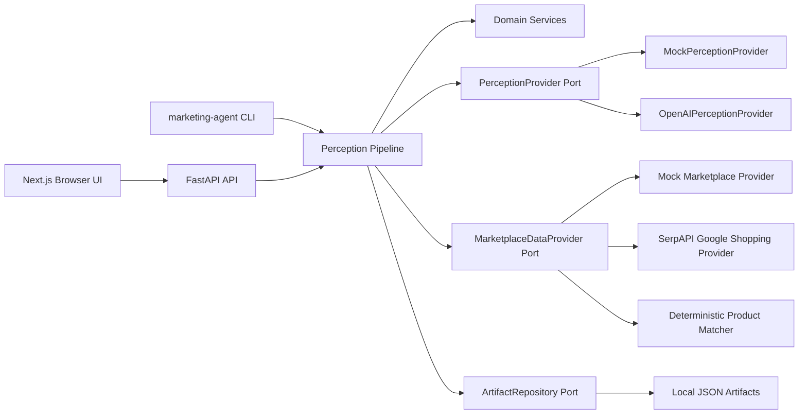
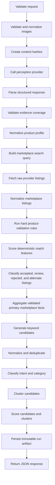

# Architecture

The system is a small modular monolith with one FastAPI process and one Next.js frontend.

Domain code does not import FastAPI, OpenAI SDKs, persistence SDKs, or vendor-specific keyword providers. Provider-specific logic lives under `apps/api/src/marketing_agent/infrastructure`.

Marketplace matching is deterministic-first. The provider adapters convert vendor
payloads into `NormalizedMarketplaceListing` records, then the domain matcher
compares them with a canonical `ProductIdentity`. LLM ambiguity review is
reserved behind disabled configuration and is not required for the pipeline.
Hard identifier, model, brand, accessory, and condition conflicts cannot be
overridden by similarity scoring.
