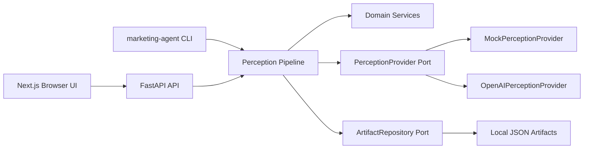
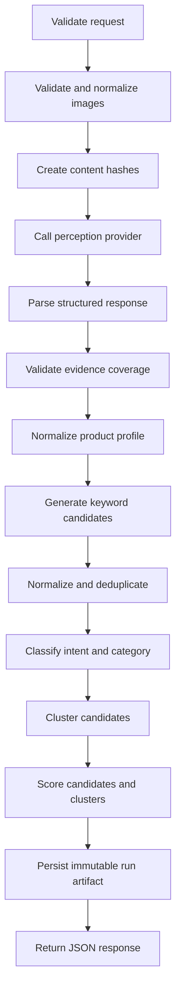

# Architecture

The system is a small modular monolith with one FastAPI process and one Next.js frontend.

Domain code does not import FastAPI, OpenAI SDKs, persistence SDKs, or vendor-specific keyword providers. Provider-specific logic lives under `apps/api/src/marketing_agent/infrastructure`.

